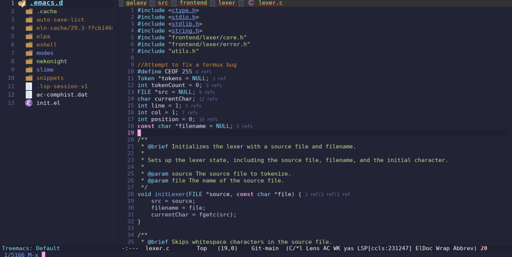
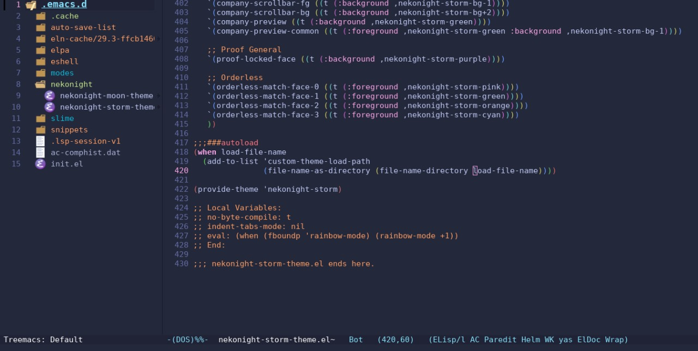

# emacs

Looking for a theme that fits your vibe? Whether you're into dark mode, light mode, or something in between, this **NekoNight** has got you covered. Written in elisp for snappy performance, it's a buffet of color schemes for every taste and mood. 🍭 Want to boost your productivity *and* look good while coding? We've got countless options to keep you inspired and in the zone. 🚀✨ If you love it (and we know you will), hit that ⭐ on our [official repo](https://github.com/neko-night/emacs). Your support means the world! 🌍

    

## 🎨 Preview
    
<table width="100%">
  <tr>
    <th>Moon</th>
    <th>Storm</th>
  </tr>
  <tr>
    <td width="50%">
      
    </td>
    <td width="50%">
        
    </td>
  </tr>
</table>
  
